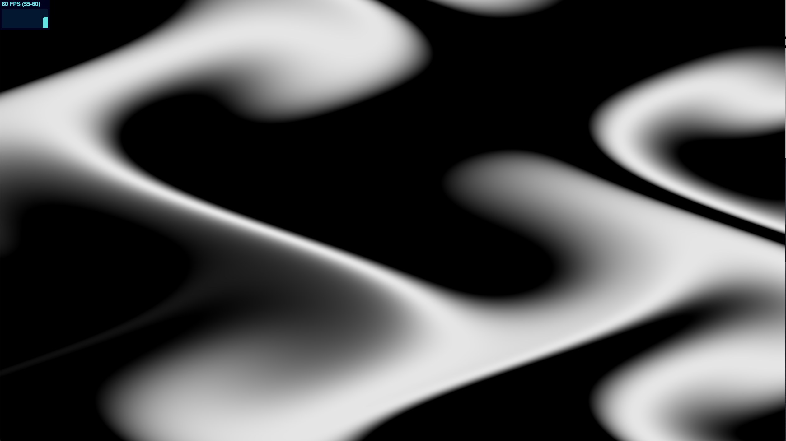
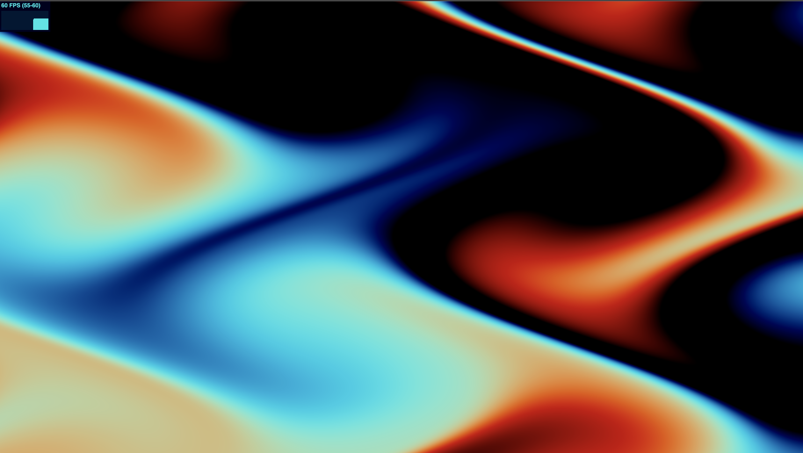
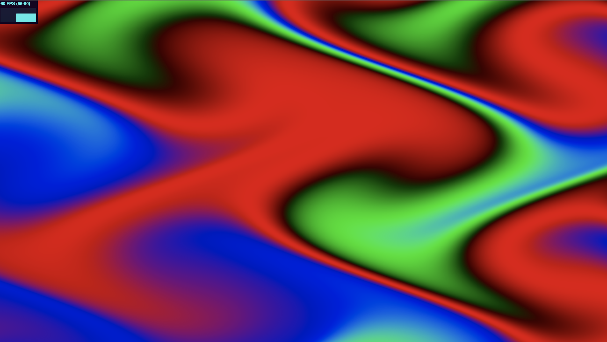

# React Threejs Interactive Shader

A very simple and highly commented example of how to make a mouse interactive shader with React, Threejs and GLSL.

## Features
- Full screen plane geometry
- Mouse interactive colors
- Resize according to window
- FPS monotoring with 'Stats' component

## Installation

Clone Repo.

```bash
git clone https://github.com/bernabranco/react-threejs-plane-geometry.git
```
Intall Dependencies.

```bash
npm install
```

## Usage

Start application.

```bash
npm start
```

Open browser on "localhost:3000"

## Prints






